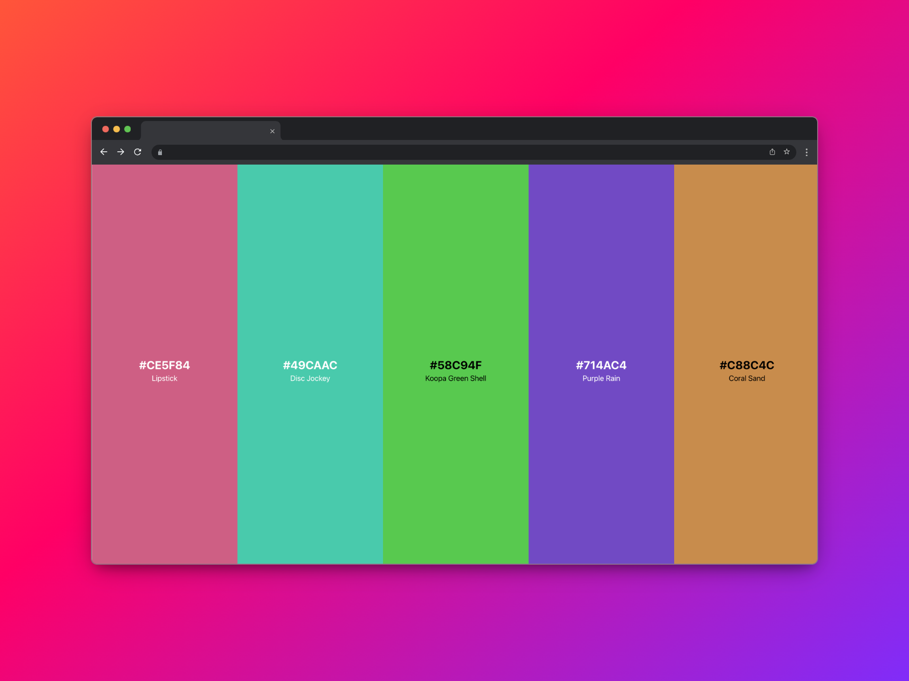

# Generador de color aleatorio con React 🎨

Este proyecto es un generador de colores aleatorios desarrollado en React y Typescript. Utiliza la librería **uniqolor** para generar nuevos colores aleatorios cada vez que se presiona la tecla **Space**. Además, utiliza funciones de **colors-convert** para convertir el color en formato hexadecimal a su contraparte de contraste (blanco o negro), lo que permite mostrar un valor de texto legible en la pantalla.

Puedes copiar el valor del color generado en formato hexadecimal haciendo clic en el campo de entrada de texto correspondiente. Simplemente para obtener una paleta de colores totalmente aleatoria y su correspondiente valor en hexadecimal.
