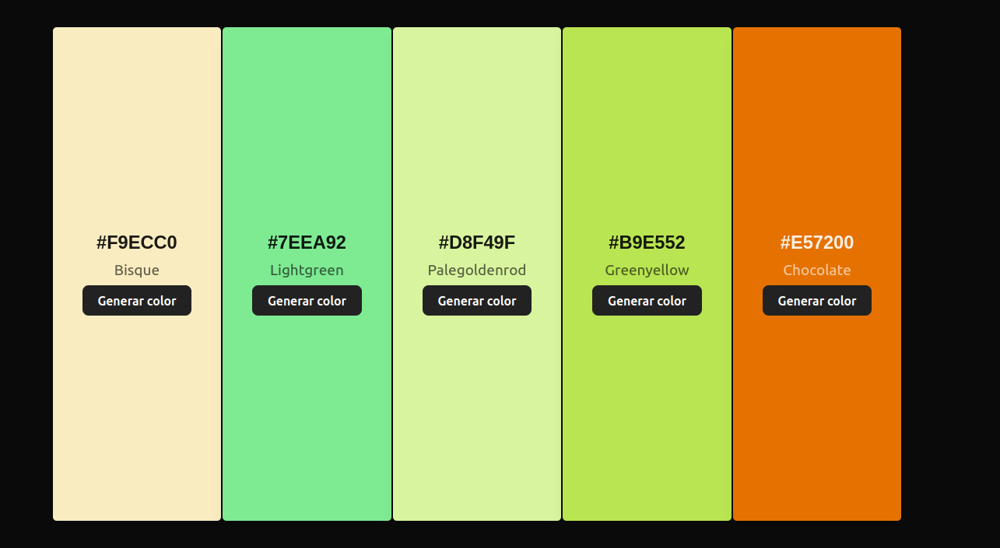

# ¡Bienvenido a mi generador de color aleatorio con React!

Este proyecto es un generador de colores aleatorios desarrollado en React. Utiliza la librería "**randomcolor**" para generar nuevos colores aleatorios cada vez que se presiona el botón "**Generar color**". Además, utiliza funciones de JavaScript para convertir el color en formato hexadecimal a su contraparte de contraste (blanco o negro), lo que permite mostrar un valor de texto legible en la pantalla.

El usuario puede copiar el valor del color generado en formato hexadecimal haciendo clic en el campo de entrada de texto correspondiente. El proyecto también incluye algunas características de estilo para el botón y la caja de color generada.

La aplicación es fácil de usar: simplemente haz clic en el botón "**Generar color**" para obtener un nuevo color aleatorio y su valor hexadecimal correspondiente.
